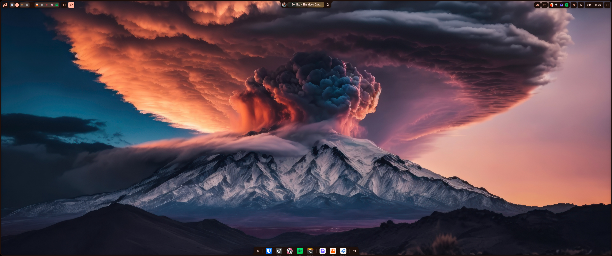
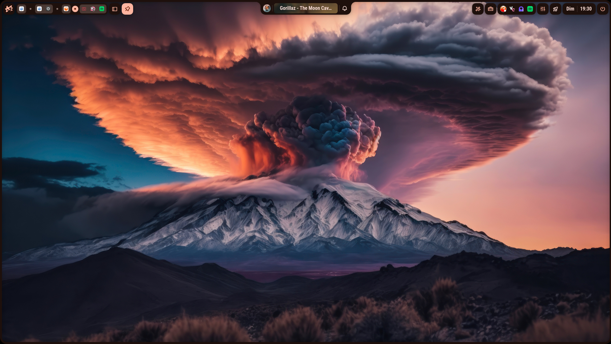
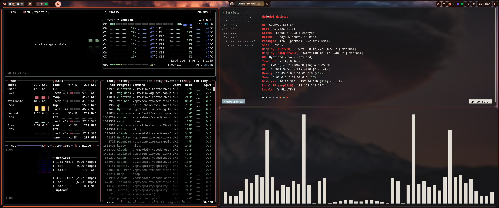
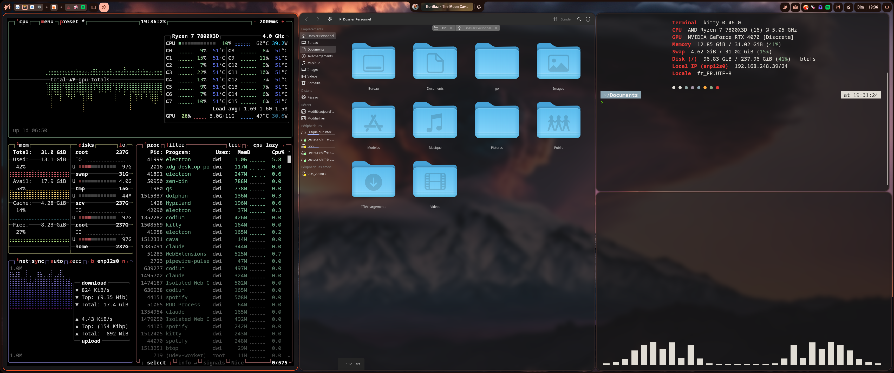
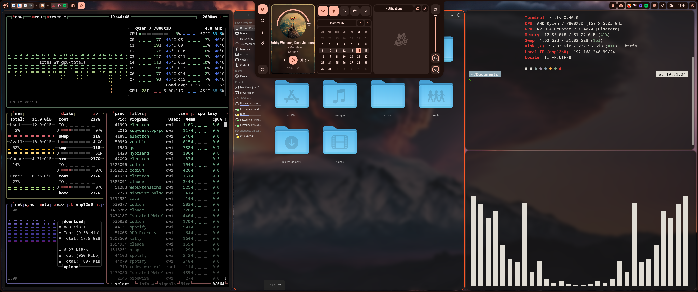

# Dragon Fire Desktop

CachyOS (Arch) + Hyprland desktop configuration with custom "Dragon Fire" theme.
Managed declaratively with **Nix Flakes** + **Home Manager**.

---

## Screenshots

| 4K Display | 1080p Display |
|:---:|:---:|
|  |  |

<details>
<summary>More screenshots</summary>





</details>

## Theme

- **Source Color**: `#fd5622` (vivid orange)
- **Accent**: `#e53935` (red)
- **Background**: dark greys (`#181616`, `#1e100c`)
- **Style**: Kanagawa Dragon inspired with Material You palette

## Stack

| Component    | Choice                        |
|-------------|-------------------------------|
| WM          | [Hyprland](https://hyprland.org/) + [hy3](https://github.com/outfoxxed/hy3) |
| Bar/Shell   | [Ambxst](https://github.com/Axenide/Ambxst) |
| Terminal    | [Kitty](https://sw.kovidgoyal.net/kitty/) |
| Shell       | [Zsh](https://www.zsh.org/) + [Oh My Zsh](https://ohmyz.sh/) + [Powerlevel10k](https://github.com/romkatv/powerlevel10k) |
| Editor      | [Vim](https://www.vim.org/) + [VSCodium](https://vscodium.com/) |
| File Manager| [Dolphin](https://apps.kde.org/dolphin/) |
| Launcher    | [Hyprlauncher](https://github.com/hyprwm/hyprlauncher) |
| GTK Theme   | [WhiteSur-Dark](https://github.com/vinceliuice/WhiteSur-gtk-theme) |
| Qt Theme    | qt6ct-kde + Fusion + [KvDarkRed](https://github.com/tsujan/Kvantum) |
| Icons       | [WhiteSur-dark](https://github.com/vinceliuice/WhiteSur-icon-theme) |
| Cursor      | [Capitaine Cursors](https://github.com/keeferrourke/capitaine-cursors) |
| Font        | [JetBrainsMono Nerd Font](https://www.nerdfonts.com/) |

## Why CachyOS?

CachyOS is an Arch-based distribution optimized for performance out of the box:
- **Performance-tuned kernel** (BORE scheduler, x86-64-v3/v4 optimized packages)
- **Stable enough for a daily driver** - rolling release with the full Arch ecosystem, but with sane defaults and a graphical installer
- **Tried Bazzite OS** for a few months - ran into persistent video issues (screen tearing, compositor glitches) that were never a problem on CachyOS, so switched back
- **Caution with LUKS + TPM2**: kernel or bootloader updates can break automatic TPM2 unlock - always keep a recovery key and re-enroll after major updates

## Prerequisites

- [CachyOS](https://cachyos.org/) (or Arch Linux)
- [Nix package manager](https://determinate.systems/nix-installer/) (standalone, not NixOS)
- System packages installed via pacman (Hyprland, pipewire, docker, etc.)

## Usage

```bash
# First time: install Nix
curl --proto '=https' --tlsv1.2 -sSf -L https://install.determinate.systems/nix | sh -s -- install

# Deploy (first time)
cd ~/Documents/dotenv
nix run home-manager -- switch --flake .#$USER

# Deploy (after changes)
home-manager switch --flake .#$USER

# Rollback to previous generation
home-manager switch --rollback

# List all generations
home-manager generations
```

## Fallback: MATE Desktop

If Hyprland breaks or is unusable (GPU issues, driver update, etc.), MATE is available as a fallback desktop:

```bash
# Install MATE
sudo pacman -S mate mate-extra

# Select MATE from the login screen (GDM/SDDM session picker)
```

## Structure

```
dotenv/
├── flake.nix                          # Nix flake entry point
├── home.nix                           # Home Manager main config
├── modules/
│   ├── packages.nix                   # CLI tools (nix-managed)
│   ├── vim.nix                        # Vim config
│   ├── zsh.nix                        # Zsh + Oh My Zsh
│   ├── kitty.nix                      # Kitty terminal
│   ├── hyprland.nix                   # Hyprland configs
│   ├── gtk.nix                        # GTK theming
│   └── qt.nix                         # Qt theming
├── scripts/
│   ├── zsh-init-first.zsh             # Zsh early init (p10k instant prompt)
│   └── zsh-init-extra.zsh             # Zsh extra init (cachyos, zoxide, etc.)
├── config/
│   ├── hypr/
│   │   ├── hyprland.conf
│   │   ├── monitors.conf
│   │   ├── hyprqt6engine.conf
│   │   └── hypridle.conf
│   ├── kitty/
│   │   ├── kitty.conf
│   │   └── kanagawa-dragon.conf
│   ├── fastfetch/config.jsonc
│   ├── gtk-3.0/settings.ini
│   ├── gtk-4.0/settings.ini
│   ├── qt6ct/qt6ct.conf
│   ├── Kvantum/kvantum.kvconfig
│   ├── kdeglobals
│   ├── ambxst/colors/Dragon_Fire/
│   │   ├── dark.json
│   │   └── light.json
│   └── VSCodium/
│       ├── extensions.txt
│       └── User/settings.json
├── screenshots/                       # Desktop screenshots
├── vim/colors/kanagawa-dragon.vim
└── vimrc
```

## How it works

Home Manager manages the user environment declaratively:
- **Dotfiles**: symlinked to `~/.config/`, `~/.vimrc`, etc.
- **CLI tools**: installed via Nix in an isolated store (doesn't conflict with pacman)
- **Idempotent**: running `home-manager switch` multiple times always produces the same result
- **Rollback**: every deployment creates a generation you can switch back to

System-level packages (Hyprland, pipewire, docker daemon, fonts, etc.) remain managed by pacman.

## Home Backup

Automated home directory backup using [restic](https://restic.net/) + [rclone](https://rclone.org/) to [kDrive](https://www.infomaniak.com/en/kdrive) (Infomaniak cloud storage).

**Secrets management chain:**
- Backup encryption password is stored in [Bitwarden Secrets Manager](https://bitwarden.com/products/secrets-manager/) (BWS)
- BWS access token is stored locally in `~/.config/bws/$USER-desktop.key`
- Restic retrieves the password from BWS on each run - never stored on disk

**How it works:**
- `home-backup backup` - incremental backup of `$HOME` to kDrive via rclone
- `home-backup prune` - retention policy: 7 daily, 4 weekly, 6 monthly snapshots
- `home-backup restore <id>` - restore a specific snapshot
- Desktop notifications via `notify-send` on success/failure

See [scripts/home-backup.sh](scripts/home-backup.sh) for the full script.
